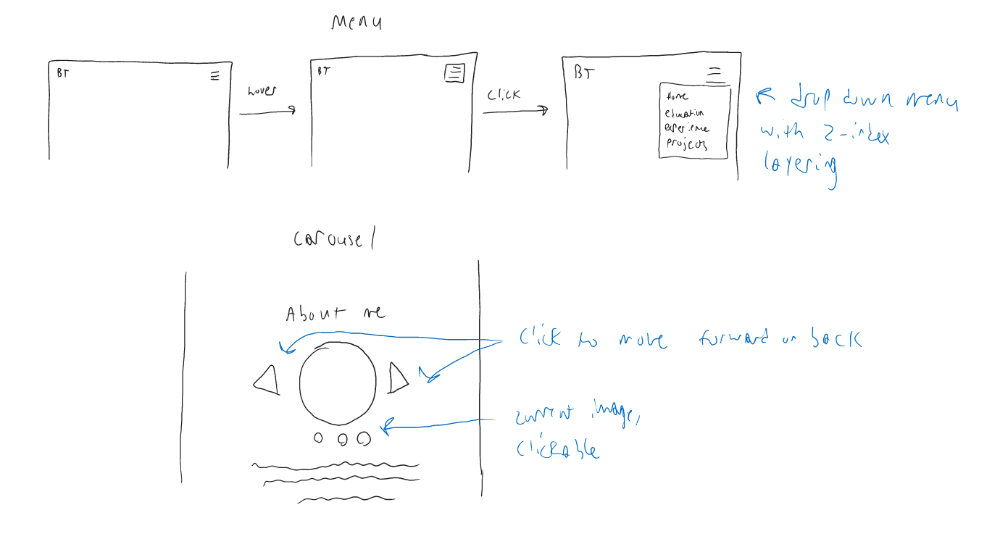
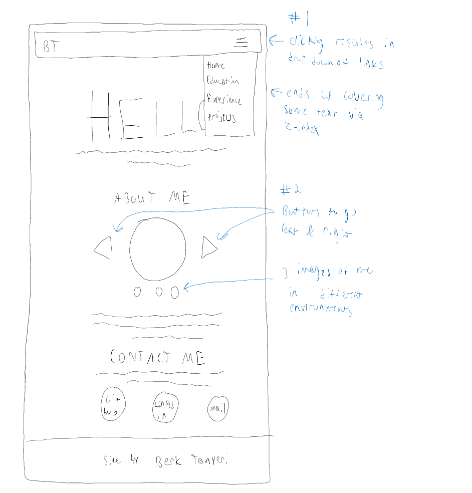

# Project 3: Design Journey

**For each milestone, complete only the sections that are labeled with that milestone.**

**Replace ALL _TODOs_ with your work.** (There should be no TODOs in the final submission.)

Be clear and concise in your writing. Bullets points are encouraged.

**Everything, including images, must be visible in Markdown Preview.** If it's not visible in Markdown Preview, then we won't grade it. We won't give you partial credit either. This is your warning.


# Existing Project

**Tell us about the project you'll be using for Project 3.**

## Project (Milestone 1)
> Which project will you add interactivity to enhance the site's functionality?

I will be using project 1, my personal website, and adding interactivity to it.


## Audience (Milestone 1)
> Who is your project site's audience?
> This should be the original audience from Project 1 or Project 2.
> You should adjust the audience if necessary. Just make sure you explain your rationale for doing so here.

My audience is for potential partners or employers to see my employment history, education, skills, and personal projects and allow them to contact me for work or any inquiries (the website is for my audience to see my resume in a visual format). By having this website coded by me, I will also be implicitly showcasing my coding and web development skills to employers.


## Audience's Goals (Milestone 1)
> List the audience's goals that you identified in Project 1 or 2.
> Just list each goal. No need to include the "Design Ideas and Choices", etc. You may adjust the goals if necessary. However, any changes you make to the goals for this project should be clearly identified and justified.

- Goal 1: Provide a summary of who I am as a student and person
- Goal 2: Showcase my academic achievement and skills that make me stand out from other potential employees
- Goal 3: Discuss my experience in the field so far from my internships, projects, and past work places
- Goal 4: In keeping with typical CS standards, use colors that complement each other


# Interactivity Design

## Interactivity Brainstorm (Milestone 1)
> Using the audience goals you identified, brainstorm possible options for interactivity to enhance the functionality of the site while also assisting the audience with their goals.
> Briefly explain idea each idea and provide a brief rationale for how the interactivity enhances the site's functionality for the audience.
> Note: You may find it easier to sketch for brainstorming. That's fine too. Do whatever you need to do to explore your ideas.

- Idea 1: A carousel in the About Me section with rotating images || Fulfills the ambitious interactivity requirement by showing me in different environments, instead of just having a basic headshot
- Idea 2: Hamburger menu for my links instead of having them written out at the top || Less ambitious activity but a nice add on by making the header more organized


## Interactivity Proposal & Rationale (Milestone 1)
> Make a decision about your site's interactivity. Explain what you plan to implement and where it will go on your site.
> Describe the purpose of your proposed interactivity. Provide a brief rationale explaining how your proposed interactivity addresses the goals of your site's audience.

**Interactivity Proposal:** Carousel  
**User Goals Rational:** A carousel in the about me section that has a rotating slideshow of different pictures of me. These pictures will be from different areas of my life such as from work, from school, and just generally show me in different environment during my academic career. This way, my audience can see me in different situations and see snapshots of different experiences i have had

**Interactivity Proposal:** Hamburger menu  
**User Goals Rational:** A hamburger menu on each age that is 3 bars in the top right corner, and when clicked on/hovered over expands to reveal all the links on my website. This would make the header look neater than it currently is by hiding all the different navigational button in a dropdown. This will make my audience feel that the website is more polished since the header isnt littered with a bunch of links


## Interactivity Design Ideation (Milestone 1)
> Now that you've made a decision about the site's interactivity, explore the possible design solutions for the interactivity.
> Sketch several iterations of your interactivity.
> Annotate each sketch explaining what happens when a user takes an action. (e.g. When user clicks this, this happens.)

  <!--- Source: (screenshot of sketch) Berk Tanyeri --->
  


## Final Interactivity Design (Milestone 1)
> Review your sketches from the previous step and pick your final design.
> Create a _polished_ sketch (it's still a sketch, but with a little more care taken to communicate ideas clearly to the graders) to plan your interactivity.
> **Sketch out the entire page where your interactivity will go.** Add your interactivity to the sketch. Add any annotations to explain what happens when the user takes an action.
> Include as many sketches as necessary to communicate your design (ask yourself, could another 1300 take these sketches an implement my design?)

<!--- Source: (screenshot of sketch) Berk Tanyeri --->


I will have 2 different items for interactivity. The main one will be the carousel in the center rotating through images, while the less ambitious one being the hamburger menu. The 2 different items are labeled in the image in blue


## "Ambitious" Interactivity Explanation
> In your own words, concisely explain why you believe your interactivity meets the "ambitious" requirement.

The carousel fulfills the ambitious requirement for me. This is because it has the 3 events on 3 different elements requirement via the left arrow, right arrow, and the current slide dot under the images. Each event is attached to a different element and therefore meets the requirement for an ambitious task


## Additional Information (Milestone 1)
> (optional) Include any additional information, justifications, or comments we should be aware of.

In addition to the carousel, I plan to have a less ambitious task because I believe it will make my website more friendly. Mainly, the hamburger menu will make my website feel less cluttered by organizing all the links under a single drop down, which will have priority over anything else on the page via z-index layering.


# Interactivity Implementation Plan (Final Submission)

## HTML Interactivity Plan (Final Submission)
> Plan the HTML elements you will use in your interactivity.
> For each element, give its `id=` (if it has one) and any default styling (`class=`)

- Hamburger menu clickable: `<button id="menubutton">`
  - Menu dropdown: `<div class = "dropdown">`
- Left arrow, picture, right arrow div: `<div class="carousel">`
  - Left arrow: `<button id="leftarrow">`
  - 3 different rotating images: ``
- 3 clickable buttons div under the carousel for specific image selection: `<div class="carouselb">`
  -  3 buttons: `<button id="buttonY"> Plan the CSS classes you will need for your interactivity

- `.hidden` hides an element
- `.clickable:hover` and `.clickable:active` changing opacity of an element on either a hover or click
- `.currentButton` changes the appearance of the button representing the image that is currently showing
- `.dropdown` is the div that sets up the dropdown hamburger menu
- `button` defines the button appearance
- `div.carousel` and `div.carouselb` defines the two divs used for the carousel
- `img.arrows` defines the appearance of the image within the arrow buttons
- `img.buttons` defines the appearance of the image within the buttons


## Interactivity Pseudocode (JavaScript) Plan (Final Submission)
> Write your interactivity pseudocode plan here.

```
variable automatic timer

When hamburger menu is clicked
  if dropdown is hidden, remove hidden class
  else if dropdown is not hidden, add hidden class

when #leftarrow is clicked
  remove .hidden class and add .currentButton to image that comes previously
  add .hidden class and remove .currentButton from current image
  reset automatic slide scrolling timer to 5 seconds and call showSlides after timeout

when #rightarrow is clicked
  remove .hidden class and add .currentButton to image that comes next
  add .hidden class and remove .currentButton from current image
  reset automatic slide scrolling timer to 5 seconds and call showSlides after timeout

when #button0 is clicked
  remove .hidden and add .currentButton to  middle0 if its hidden
  add .hidden and remove .currentButton from middle1 and middle 2 if they are not hidden
  reset automatic slide scrolling timer to 5 seconds and call showSlides after timeout

when #button1 is clicked
  remove .hidden and add .currentButton to middle1 if its hidden
  add .hidden and remove .currentButton from middle0 and middle 2 if they are not hidden
  reset automatic slide scrolling timer to 5 seconds and call showSlides after timeout

when #button2 is clicked
  remove .hidden and add .currentButton to middle2 if its hidden
  add .hidden and remove .currentButton from middle0 and middle 1 if they are not hidden
  reset automatic slide scrolling timer to 5 seconds and call showSlides after timeout

showSlides function
  add .hidden and remove .currentButton from current image
  remove .hidden and add .currentButton to next image
  reset automatic timer to 2.5 seconds (advances to next image every 2.5 seconds) and call showSlides after timeout

```

# Grading (Final Submission)

## Interactivity Usability Justification (Final Submission)
> Explain how your design effectively uses affordances, visibility, feedback, and familiarity.  

- Hamburger menu
  - Affordance - The mouse pointer becomes a hand pointing when hovering over the three hamburger lines, and the button dims giving a strong clue it is clickable
  - Visibility - The button is visible at the top of the page, and the menu is visible when clicked
  - Feedback - Clicking the button gives the immediate effect of a menu popping up
  - Familiarity - Hamburger menus are an established design for expanding navigational links
- Carousel menu
  - Affordance - Left and right arrows give a strong clue that they can be clicked to advance to the next image. In addition, the arrows and buttons below also dim and change the cursor also giving a strong clue they can be clicked
  - Visibility - All the arrows and buttons are visible to the user
  - Feedback - Clicking the arrows or buttons gives an immediate effect of changing the displayed image
  - Familiarity - Carousels with left and right buttons and buttons below allowing specific image selection are established designs for showcasing a set of rotating images


## Additional Design Justifications (Final Submission)
> If you feel like you haven’t fully explained your design choices in the final submission, or you want to explain some functions in your site (e.g., if you feel like you make a special design choice which might not meet the final requirement), you can use the additional design justifications to justify your design choices. Remember, this is place for you to justify your design choices which you haven’t covered in the design journey. Use it wisely. However, you don’t need to fill out this section if you think all design choices have been well explained in the final submission design journey.

I felt the carousel was originally too static, so I solved this by making a function that automatically sets a timer and rotates the images every 2.5 seconds. However, I also made it so that if the arrows or  buttons are pressed, the timer is cleared and set to 5 seconds (instead of 2.5 seconds) allowing a little more time for the user to see their selected image before beginning the automatic rotation again

## Tell us What to Grade (Final Submission)
> We aren't re-grading your Project 1 or 2. We are only grading the interactivity you added.
> Tell us where (what page) we can find your interactivity and how to use it.
> **We will only grade what you list here;** if it's not listed, we won't grade it.

Interactivity can be found on the index.html page under the "About Me" section. the carousel is my ambitious interactivity. You can go left to the previous image or right to the next image. You can also click on the buttons to go to a specific image out of order  

I also did a basic hamburger menu for fun since it seemed appropriate and made my website look more professional. This menu is available on every page in the project


## Additional Resources/References (Final Submission)
> If you referenced other websites (or sources, including tutorials) on this project, list them here.

I used [this w3schools documentation](https://www.w3schools.com/js/js_timing.asp) to learn about clearTimeout(timer) for resetting a timer variable and setTimeout(function, time) for setting how long to wait before executing a function. This helped me do the automatic carousel rotation.  

I did not use the [setInterval from the Interactivity Snippets](https://pages.github.coecis.cornell.edu/info1300-2022sp/documents/project3/interactivity-snippets.html#timer-every-n-seconds-event-snippet--example) because i didnt want to repeat a function continuously, which is what setInterval does. I wanted to be able to reset the timer. Therefore, I used timeout instead of interval.


## Self-Reflection (Final Submission)
> This was the first project in this class where you coded some JavaScript. What did you learn from this experience?

In this project, I learned how to create interactivity when a user performs an action with my website. I learned that this is done through showing and hiding content, allowing a web developer to have a lot of information packed into a single space just by showing and hiding elements based on user input.


> Reflect on how HTML, CSS, and JavaScript together support client-side interactivity. If it's helpful, you can describe your mental model of client-side interactivity or explain how the general idea of showing and hiding content can be used to implement other forms of client-side interactivity beyond what you've done in this project.

Together, the 3 languages make up the web development stack for client side interactivity. We finally put all the languages together in this project: HTML for content, CSS for visuals, and javascript for reacting to user input. These languages have taught me how to make a presentable website that looks good to my users and allows them to interact with buttons through the showing and hiding of content. This opens the door to many possibilities, since showing and hiding elements based on user clicks could allow for a multitude of features to be present in a small space on a single page.


> Take some time here to reflect on how much you've learned since you started this class. It's often easy to ignore our own progress. Take a moment and think about your accomplishments in this class. Hopefully you'll recognize that you've accomplished a lot and that you should be very proud of those accomplishments!

With this project, I feel I have learned a significant amount of client side web development and can code content, visuals, and interactivity all on my own. I also know I can user test my decisions to ensure they meet user expectations.
